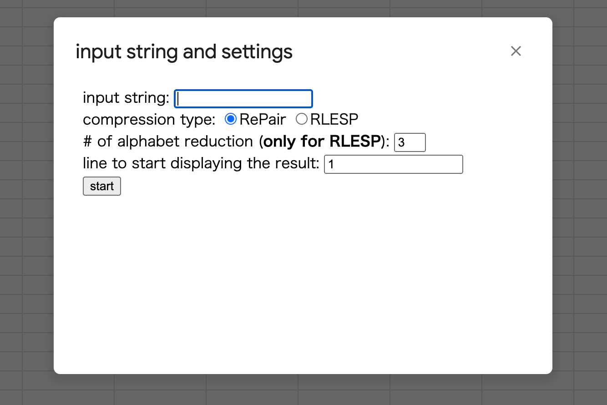
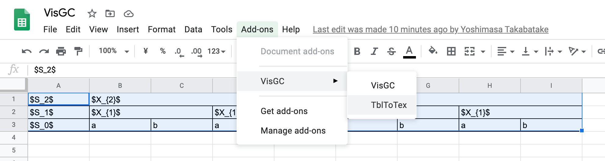

# VisGC

This tool is a visualization of the execution flow of grammar compressions ([RePair](https://ieeexplore.ieee.org/document/892708) and [RLESP](https://www.sciencedirect.com/science/article/abs/pii/S0166218X19300319?via%3Dihub)(signature encoding)).

## Installation

Access https://docs.google.com/spreadsheets/d/1gcr5qd2ceu0S38p3n7sdK9GHqt5Uur6R52Qil8A7278/edit?usp=sharing and then copy the spreadsheet in your google drive.
　　
## Execution
1. Click add-ons>VisGC>VisGC to open the popup window (input string and settings). 

2. In the popup window, set the input string, select the compression type, set the number of alphabet reduction (only for RLESP) and set the line to start displaying the result.

3. click the start button and then get the execution flow in your spreadsheet.

## Transforming your spreadsheet table into the latex's tabular. 

Select the table that you want to transform into the latex's table, click add-ons>VisGC>TblToTex and then get the transformation result in the popup window.

